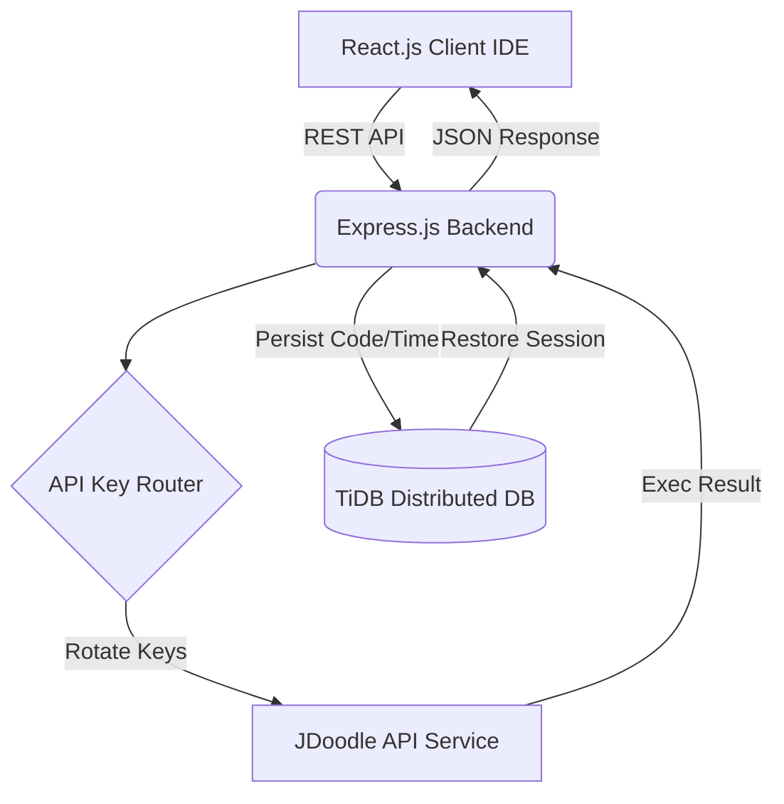

# 🚀 QMAZE IDE v2.0 - A-Z Project Analysis Report

This document provides a comprehensive technical breakdown of the **QMAZE IDE** - a high-performance, secure, and competitive pattern-matching evaluation platform.

---

## 🏗️ 1. System Architecture

The application follows a robust **MERN-like architecture** but is optimized for high-concurrency environments like college hackathons.

| Component | Technology | Role |
| :--- | :--- | :--- |
| **Frontend** | React (Vite) | Cyberpunk UI, Security Monitors, Code Editor |
| **Backend** | Node.js / Express | Execution Queue, Key Rotation, Session Management |
| **Database** | TiDB (MySQL) | Distributed storage for high-parallel session data |
| **Executor** | JDoodle API Pool | Multi-key sandbox for C and Java compilation |

---

## 🧠 2. Backend Logic (The Intelligence)

### 🔄 Multi-Key Rotation System
To bypass standard API rate limits, the backend implements a **Secret Key Rotation**.
- **Pool Size**: 22 Hardcoded JDoodle Credentials.
- **Logic**: Each request cycles through `currentJdoodleKeyIndex`. If a key fails (429/401), it automatically rotates to the next available key.
- **Result**: Effectively infinite execution quota for a large number of participants.

### ⏳ High-Concurrency Queue
The server manages an internal queue to prevent CPU spikes:
- **C Limits**: Max 5 parallel executions.
- **Java Limits**: Max 1 parallel execution (due to memory intensity).
- **Cooldown**: 5-second mandatory wait between `RUN` clicks per user.

### 🛡️ Absolute Timer Control
- The timer is **server-authoritative**. 
- It stores `start_time` in the DB. The frontend calculates `Remaining = Total - (Now - Start)`.
- **Anti-Cheat**: Refreshing the page or changing system clock does not reset the timer.

---

## 💻 3. Frontend Implementation (The Security Shell)

### 🧩 Core Components
1. **`EditorLayout.jsx`**: Manages the main state, including auto-save every 5 seconds.
2. **`CodeEditor.jsx`**: Integrated Monaco/Ace-style editor with paste blocking.
3. **`PatternView.jsx`**: Renders the target pattern students need to match.

### 🔒 Security Gateways
- **Window Focus Monitoring**: Tracks `visibilitychange`. If the user switches tabs, the backend logs a warning and the UI locks with a Red Alert.
- **Paste Shield**: Direct interception of the "paste" event to ensure code is typed manually.
- **Dynamic Policy**: Fetches `PASTE_SECURITY` and `FOCUS_SECURITY` flags from the DB live, allowing admins to toggle security without a restart.

---

## 📊 4. Database & Data Structure

### `users` Table
| Column | Type | Purpose |
| :--- | :--- | :--- |
| `lot_number` | VARCHAR (PK) | Unique ID for the participant |
| `status` | ENUM | `active`, `finished`, `disqualified` |
| `code_data` | LONGTEXT | JSON blob storing code for ALL levels |
| `warnings` | INT | Count of security violations (Tab-switching) |
| `no_of_loops` | INT | Used for leaderboard tie-breaking |

### `patterns` Table
Stores the challenges dynamically, allowing admins to add levels via the UI.

---

## 🏆 5. Leaderboard Ranking Algorithm
Ranking is not just based on speed. It follows a strict priority:
1. **Least Warnings** (Integrity)
2. **Total Patterns Completed** (Progress)
3. **Least Loops** (Algorithm Optimization)
4. **Fastest Total Time** (Efficiency)
5. **Fewer Lines of Code** (Minification)

---

## 💡 6. Future Recommendations (Roadmap)

- [ ] **WebSockets**: Replace current 5s polling with Socket.io for real-time progress updates.
- [ ] **Dockerized Sandbox**: Moving from JDoodle to an internal Docker-based executor for zero-latency execution.
- [ ] **Live Admin Control**: A "Kill Switch" for specific users directly from the leaderboard.

---

**Report Generated for:** Rishidevlx  
**Project:** QMAZE IDE v2.0  
**Status:** Architecture Validated 🚀
